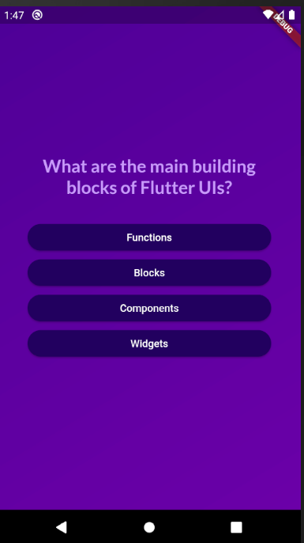
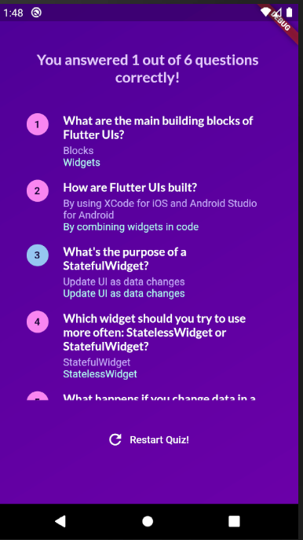

# Quiz App

A mobile quiz application built using Flutter, a cross-platform framework for building native mobile apps. The app presents a series of multiple-choice questions on various topics, allowing users to select their answers. Immediate feedback is provided to users on whether their answers are correct or not. Upon completing the quiz, the app displays a summary of the user's answers along with the correct answers for comparison.

## Features

- Multiple-choice questions with random answer options.
- Instant feedback on user-selected answers.
- Summary screen displaying user's answers and correct answers.
- Custom styling using Google Fonts and themed colors.
- State management for efficient app state handling.

## Screenshots

## Technologies Used

- Flutter Framework
- Dart Programming Language
- Google Fonts
- State Management

## Contributing

Contributions are welcome! If you find any issues or want to add new features, feel free to open a pull request.

## About

This project serves as a demonstration of my skills in mobile app development using Flutter. It showcases my ability to create engaging and interactive apps while managing app state efficiently.
